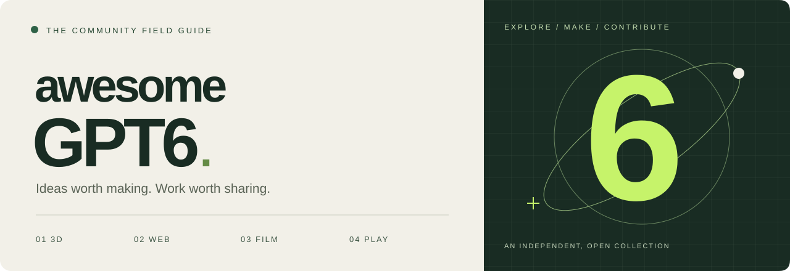
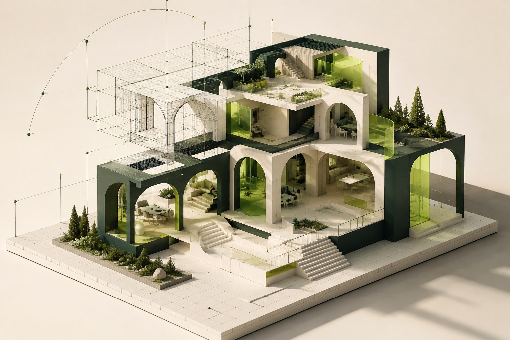
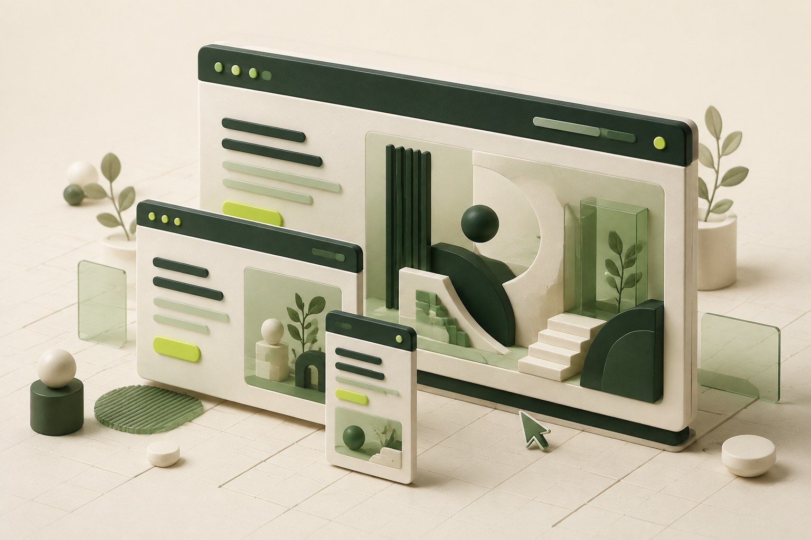
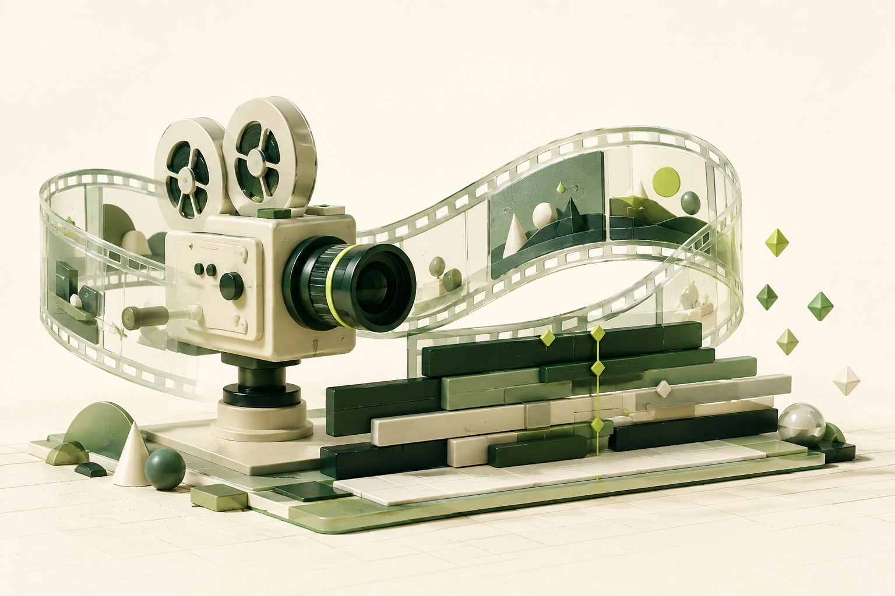
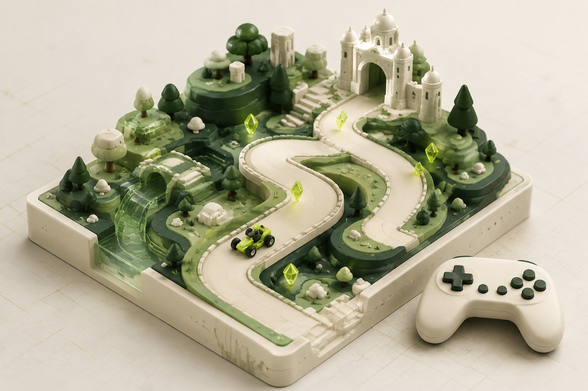

  

<h1 align="center">Awesome GPT6</h1>

把灵感变成作品。收藏值得研究的 GPT‑6 案例、提示词与创作过程。

<strong>3D 建模 · 网页设计 · 视频制作 · 游戏开发</strong>

  
  
  

<a href="#explore">探索分类</a> · <a href="#collection">首批精选</a> · <a href="prompts/README.md">提示词起点</a> · <a href="CONTRIBUTING.md">参与共建</a> · <a href="docs/maintaining.md">维护指南</a>

---

### 少一些堆砌，多一些值得复现的作品。

一个由社区共建的 GPT‑6 创作索引。我们关注**做出了什么、如何做到、证据在哪里**。首版刻意保持轻量，先建立清晰的分类和收录标准，再逐步积累作品。

> **阅读说明**：已核对来源 ≠ 已独立复现。每个条目分别记录来源、模型声明、提示词出处和复现状态。本站为非官方社区项目，与 OpenAI 无隶属关系。

## 四个创作方向

<table>
  <tr>
    <td width="50%" valign="top">
      
      <h3>01 / 3D · 从形状到空间</h3>
      
Blender、CAD、可编辑模型与场景。让一个想法拥有形体、材质和尺度。

      
<a href="cases/3d/README.md"><strong>探索建模案例 →</strong></a>

    </td>
    <td width="50%" valign="top">
      
      <h3>02 / WEB · 让界面回应你</h3>
      
网站、交互界面与前端实现。把信息、视觉和操作，组织成自然的体验。

      
<a href="cases/web/README.md"><strong>探索网页案例 →</strong></a>

    </td>
  </tr>
  <tr>
    <td width="50%" valign="top">
      
      <h3>03 / FILM · 把时间变成画面</h3>
      
动效、分镜、程序化视频与剪辑工作流。让画面沿着节奏展开。

      
<a href="cases/video/README.md"><strong>探索视频创作 →</strong></a>

    </td>
    <td width="50%" valign="top">
      
      <h3>04 / PLAY · 创造一个可玩的世界</h3>
      
游戏原型、玩法与可玩体验。从一个有趣的机制，走向真正想玩的作品。

      
<a href="cases/games/README.md"><strong>探索游戏案例 →</strong></a>

    </td>
  </tr>
</table>

四张栏目配图为 AI 生成的概念插画，用于视觉导航，并非收录案例的实际截图。<a href="assets/generation-prompts.md">查看素材说明与生成提示词</a>

## 首批精选

| 案例 | 看点 | 证据状态 |
| :--- | :--- | :--- |
| [Blender 房屋 → UE5 漫游](cases/3d/blender-to-unreal.md) | 模型到可探索空间的跨工具过程 | 官方展示 · 未复现 |
| [Career website 网页演示](cases/web/career-website.md) | 网站制作中的需求澄清与协作 | 官方展示 · 未复现 |
| [Playco：从灰盒到三种游戏主题](cases/games/playco-prototypes.md) | 共用玩法基础，比较不同美术方向 | 官方客户案例 · 未复现 |

**视频方向的线索**：[HyperFrames 创作展示](cases/video/hyperframes-showcase.md)已找到作者原帖链接；当前只能核对聚合页转述，因此放在候选区，不计入已核对精选。

## 从一个好提示词开始

- [四类创作的起始模板](prompts/README.md)：整理者原创，未经 GPT‑6 实测，适合修改后尝试。
- [社区提示词线索](prompts/community.md)：保留出处和原文可用性，不把推测包装成作者原文。
- [统一案例模板](templates/case.md)：将提示词、工具、结果、局限和复现证据放在同一个地方。

## 把你的作品放进来

**不会 Git？** [填写投稿表单](https://github.com/zender555/awesome-gpt6/issues/new?template=submit-case.yml)，附上原始链接、模型信息和作品。维护者审核后整理收录。

**熟悉 Git？** Fork 本仓库 → 复制 [案例模板](templates/case.md) → 添加条目和分类索引 → 提交 Pull Request。详见 [贡献指南](CONTRIBUTING.md)。

也欢迎[修正信息或报告失效链接](https://github.com/zender555/awesome-gpt6/issues/new?template=correction.yml)。投稿不会自动成为精选，引用他人作品请保留署名与出处。

## 资料与致谢

- [GPT‑6 Astra 官方发布页](https://openai.com/index/gpt-6-astra/) · [官方模型指南](https://developers.openai.com/api/docs/guides/latest-model)
- 结构灵感来自 [freestylefly/awesome-gpt-image-2](https://github.com/freestylefly/awesome-gpt-image-2)。本仓库独立编写，未复制其案例库或视觉素材。
- 自有文字、模板与封面使用 [MIT License](LICENSE)；第三方作品、商标与原始提示词的权利归各自权利人，链接收录不代表取得转载或商用授权。

CURATED WITH INTENT. BUILT WITH THE COMMUNITY.

